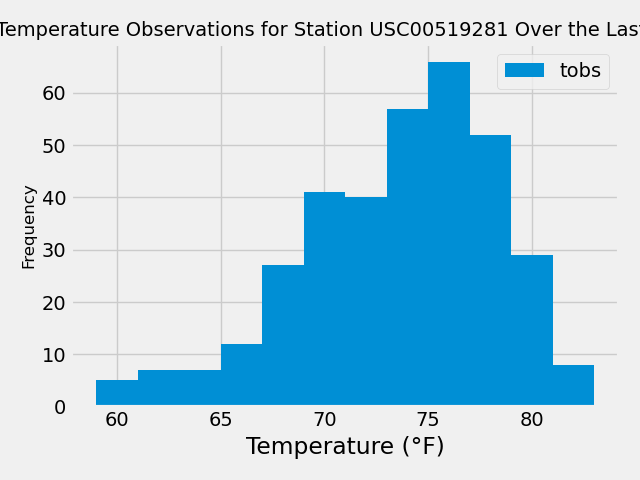

# Hawaii Climate Data Analysis

This project analyzes climate data from Hawaii, including precipitation and temperature observations. It provides a Flask API to access the data.

## Contents
- [Description](#description)
- [Installation](#installation)
- [Usage](#usage)
- [API Endpoints](#api-endpoints)
- [Information](#information)

## Description
The project consists of two main components:
1. `climate.ipynb`: This Jupyter Notebook contains data analysis and visualization code using Python libraries such as Pandas, Matplotlib, and SQLAlchemy. It explores precipitation and temperature data from Hawaii over a specific period.
2. `app.py`: This Flask application serves as the backend for the API. It provides endpoints to access precipitation, station information, temperature observations, and temperature statistics for given date ranges.

## Installation
To run the code locally, follow these steps:
1. Clone the repository.
2. Ensure you have SQLite installed or modify the database connection in `app.py` to use a different database system.
3. Run `app.py` using `python app.py` and access the API endpoints in your browser or via a tool like Postman.

## Usage
1. Open `climate.ipynb` in a Jupyter Notebook environment to explore the climate data analysis and visualization.
2. Run `app.py` to start the Flask server.
3. Access the API endpoints described below to retrieve climate data.

## API Endpoints
- `/api/v1.0/precipitation`: Returns precipitation data for the last year.
- `/api/v1.0/stations`: Returns a list of stations.
- `/api/v1.0/tobs`: Returns temperature observations (tobs) for the most active station for the last year.
- `/api/v1.0/<start>`: Returns TMIN, TAVG, TMAX for a given start date.
- `/api/v1.0/<start>/<end>`: Returns TMIN, TAVG, TMAX for a given start-end date range.

## Information

### Precipitation Statistics
The following statistics summarize the precipitation data for the last year:

- **Count**: 2015
- **Mean**: 0.176462 inches
- **Standard Deviation**: 0.460288 inches
- **Minimum**: 0.000000 inches
- **25th Percentile**: 0.000000 inches
- **Median (50th Percentile)**: 0.020000 inches
- **75th Percentile**: 0.130000 inches
- **Maximum**: 6.700000 inches

### Temperature Observations (TOBS) Statistics
The following statistics summarize the temperature observations (TOBS) for the most active station over the last year:

- **Count**: 351
- **Mean**: 73.096866 °F
- **Standard Deviation**: 4.735491 °F
- **Minimum**: 59.000000 °F
- **25th Percentile**: 70.000000 °F
- **Median (50th Percentile)**: 74.000000 °F
- **75th Percentile**: 77.000000 °F
- **Maximum**: 83.000000 °F
